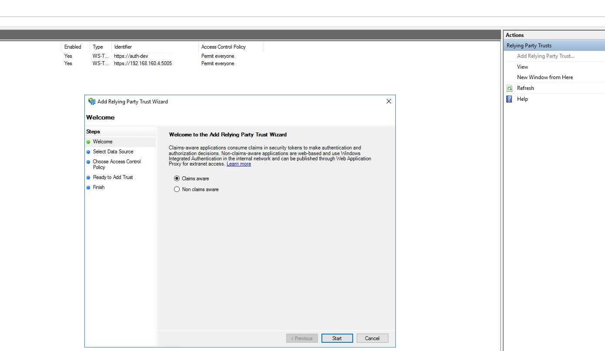

# Using ADFS with SAML

## Intro
**ADFS** (Active Directory Federation Services) is one of the more simple **SAML** setups.
**ADFS** is made by Microsoft which runs on Windows Servers when installed.
It has slightly different terminology and naming when setting up **SAML** as it was not initial design to support this.
Thus some words to keep in mind.

**ADFS** = **SAML 2.0** Spec
- Federation Metadata = Metadata
- `Relying Party Trust` = SP (Service Provider)


## Let's set it up

On the IDP you must setup a `Relying Party Trust`.
To do this you will need to connect or login the **ADFS** server and open `AD FS Management`.


#### AD FS Management Console Window :

On the right-hand side click `Add Relying Party Trust`


#### Add `Relying Party Trust` Window :
You will normally* want to use the first option `Claims Aware` to create a `Relying Party Trust` that is connecting to a claims aware `Relying Party`


#### Import data about the `Relying Party` :

This where you can use a `metadata` url, `metadata` xml document or manually define the information about the `Relying Party`
When using **SAML** it is always best practice to use a proper valid CA signed certificate.
Most service **ADFS** include by default only support import metadata on a server with a valid SSL certificate being used.
Also when validating Assertion signatures by default most providers want Valid CA signed X509Certificates to validate the signature also including **ADFS**.
(For more on using self-signed certificates with **ADFS** see [PowerUsers section](#adfs-power-users))

1. Use Metadata Url (Must be accessible from the server) (**Recommended** as you can utilize the auto update feature)
2. Use XML Metadata Document
3. Manually defined configuration

#### The first step following your import type:

#### Enter a Friendly/Display Name and Notes:
After importing the metadata you will be prompted to enter a
friendly/display name and notes for the current `Relying Party` you are creating.


#### Using options 1 & 2 the following steps are the same:


#### Set user access restrictions:

This step allows you to set which users can be authenticated with this `Relying Party`.
This can be done now during setup or after.

Configure then click next.

#### Setup Overview of your current `Relying Party`
#### Overview when using url metadata:


#### Overview when using xml or manually defined metadata:


#### Overview Identifiers:


#### Overview encryption:


#### Overview signature:


#### Overview accepted claims:


#### Overview organization:


#### Overview endpoints:


#### Overview advanced:


#### Using option 3:

put manual details here

## You have successfully create the `Relying Party Trust`
---

### Create your **NameID** Claims rule:


## <a name="adfs-power-users"></a> **ADFS** PowerUsers

## ADFS Metadata link
ADFS uses a standard metadata url format `https://{subdomain.yourdomain.com}/FederationMetadata/2007-06/FederationMetadata.xml`

For Example:
>[```https://fs.wastemanagement.co.nz/FederationMetadata/2007-06/FederationMetadata.xml```](https://fs.wastemanagement.co.nz/FederationMetadata/2007-06/FederationMetadata.xml)


