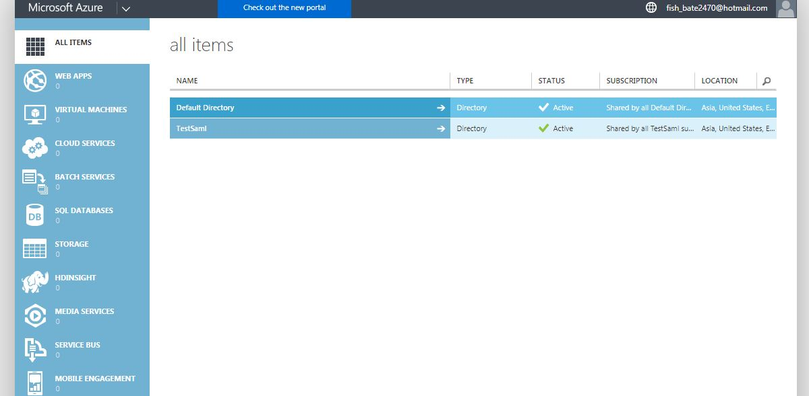
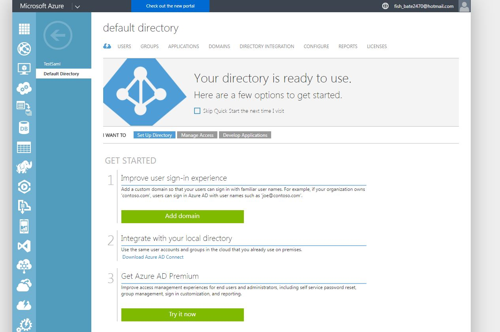
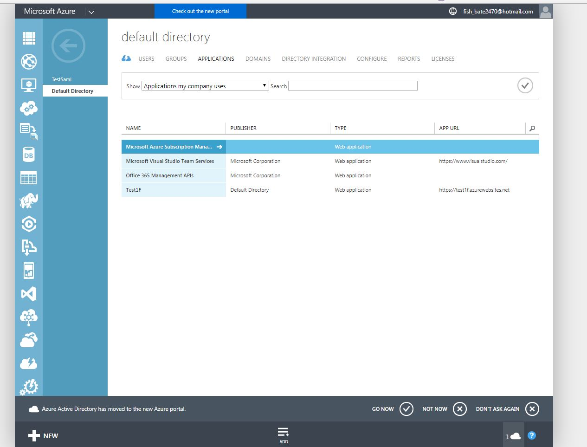
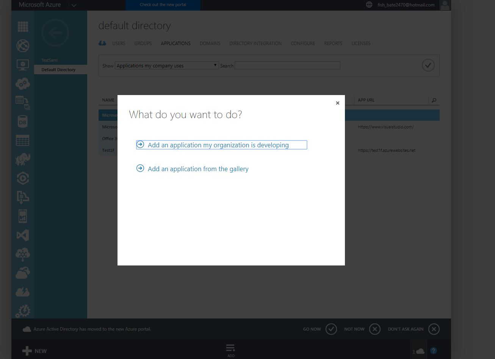

# AzureAD

#### Info
Using Azure AD you have to options.
1. [Use AzureAD Free or Basic](#old-azure-guide) with the **old** [Azure Portal](https://manage.windowsazure.com).
2. [Use AzureAD Premium](#new-azure-guide) (Expensive Subscription required) with the new [Azure Portal](https://portal.azure.com) and get all the extra features and configuration options

##   1. AzureAD Free/Basic using the Old Azure Portal

To start with you will want to open up and login to the old [Azure Portal](https://manage.windowsazure.com). 

To be able to add the application you will need to select the AzureAD directory to work with.

You will then get display the Directory's 'overview/get started' page. You will need to click on applications.

Now you will have a list of your current applications (if you have any). At the bottom of the screen there is a button to add application, you will want to click this to start the process.

You will now be displayed with a modal (popover), asking you to what to add you we will be using `'Add an Application my Organiazation is developing'`.

##   2. AzureAD Premium using the New Azure Portal